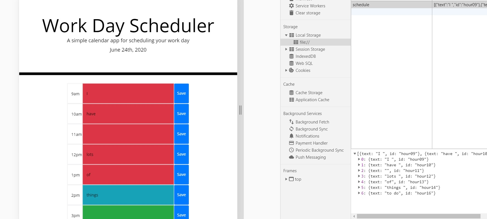

# Work Day Scheduler

For this challenge I made a scheduling application that will save tasks to be done and show what time of day it is.

##Saving Data

    I first created divs with one row and 3 columns using bootstrap grid

    I then added input and a save button for each hour of the day

    I used Jquery to grab 'this' button, the input and the row class, and save the data into JSON storage

    I then use json parse to find the row ID and place the text value inside the corresponding ID

    Upon reloading the page the data is retrieved and displayed in the input area it was saved in.

    ## Use of Moment JS

        First I used Moment.JS to show what the current date is at the top of the pagegitt 

        I used a for loop to grab all of the hour elements

        I then took the hour element on my schedule and checked it against what the time of day is

        I added classes to change the background color based on if the hour had past, is right now or is coming later.

        